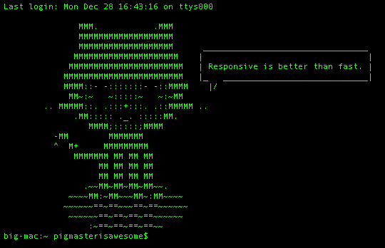

#Chapter 2: Octowisdom


We've all attempted some sort of version control, whether our memory, a private system, git, or another. Management is an important skill, but when it comes down to it, knowing the system that you _do_ have to work with is important. Today, I'm just going to show you a bit about my new GitHub app, Octowisdom, and how I worked out its kinks. Note: This requires absolutely _**NO OCTOKIT**_. Just Python, bash, and cURL. I dislike uncommon dependencies as much as anyone.

I was bored, surfing the GitHub, and looking for something to do or make, when I ran across a fun program called Octocatsay. I had already found out about the GitHub API, being a developer, and was studying some of the more important systems, for managing repositories and users from the command line.

Octocatsay is an imitation of cowsay from a GitHub fan, and I laughed at the project. It sounded like I would have a lot of fun with it, and it just made it better when I realized that it was hosted on the GitHub API! My native GitHub apps could use this software, no extra dependencies required...

I decided to make a simple POC type program that piped GitHub zen into Octocatsay and then print the end result to the users. I knew that the original zen command would look something like this:

```
$ curl https://api.github.com/zen
```

And that the format for specifying Octocatsay messages was:

```
$ curl https://api.github.com/octocat?s=HELLO%20WORLD
```

To produce something like this:

```

               MMM.           .MMM
               MMMMMMMMMMMMMMMMMMM
               MMMMMMMMMMMMMMMMMMM      _____________
              MMMMMMMMMMMMMMMMMMMMM    |             |
             MMMMMMMMMMMMMMMMMMMMMMM   | HELLO WORLD |
            MMMMMMMMMMMMMMMMMMMMMMMM   |_   _________|
            MMMM::- -:::::::- -::MMMM    |/
             MM~:~   ~:::::~   ~:~MM
        .. MMMMM::. .:::+:::. .::MMMMM ..
              .MM::::: ._. :::::MM.
                 MMMM;:::::;MMMM
          -MM        MMMMMMM
          ^  M+     MMMMMMMMM
              MMMMMMM MM MM MM
                   MM MM MM MM
                   MM MM MM MM
                .~~MM~MM~MM~MM~~.
             ~~~~MM:~MM~~~MM~:MM~~~~
            ~~~~~~==~==~~~==~==~~~~~~
             ~~~~~~==~==~==~==~~~~~~
                 :~==~==~==~==~~
```

I had a good knowledge of the GitHub API, but I didn't trust myself with bash's string parsing. I mean, I thought that a | b would just make bash run whatever code resulted from boutput_of_a.

Because this didn't work, I realized that it appends _arguments_, not plain _characters_. However, that's exactly what I needed it to do, append the zen to curl https://api.github.com/octocat?s= and then run it. So, I turned to Python.

Python 2.7 has a built in module called "commands" that lets you interact with the command line of your system. In this tutorial, we'll mainly be using the commands.getoutput(string) method of commands, so we can have our program query GitHub and then swallow the answer. But, before we start scripting anything, we need to import the necessary modules.

```python
import commands;
```

As I have previously stated, we then want to get some zen into python by running
```python
commands.getoutput('curl https://api.github.com/zen')
```

If you run and print that in the interactive Python compiler, you'll quickly realize that download status is also being returned. That's not good! We can fix this by adding the -s [silent flag] after curl.

```python
>>> import commands;
>>> commands.getoutput('curl -s https://api.github.com/zen')
'Responsive is better than fast.'
```

Awesome! Now we can process zen as a string in Python! Let's write the code to pipe it into octocatsay! It should look something like this:
```python
>>> commands.getoutput('curl -s https://api.github.com/octocat?s='+commands.getoutput('curl -s https://api.github.com/zen'))
'\n               MMM.           .MMM\n               MMMMMMMMMMMMMMMMMMM\n               MMMMMMMMMMMMMMMMMMM      ________\n              MMMMMMMMMMMMMMMMMMMMM    |        |\n             MMMMMMMMMMMMMMMMMMMMMMM   | Design |\n            MMMMMMMMMMMMMMMMMMMMMMMM   |_   ____|\n            MMMM::- -:::::::- -::MMMM    |/\n             MM~:~   ~:::::~   ~:~MM\n        .. MMMMM::. .:::+:::. .::MMMMM ..\n              .MM::::: ._. :::::MM.\n                 MMMM;:::::;MMMM\n          -MM        MMMMMMM\n          ^  M+     MMMMMMMMM\n              MMMMMMM MM MM MM\n                   MM MM MM MM\n                   MM MM MM MM\n                .~~MM~MM~MM~MM~~.\n             ~~~~MM:~MM~~~MM~:MM~~~~\n            ~~~~~~==~==~~~==~==~~~~~~\n             ~~~~~~==~==~==~==~~~~~~\n                 :~==~==~==~==~~\n<html>\r\n<head><title>301 Moved Permanently</title></head>\r\n<body bgcolor="white">\r\n<center><h1>301 Moved Permanently</h1></center>\r\n<hr><center>nginx</center>\r\n</body>\r\n</html>\r\n<html>\r\n<head><title>301 Moved Permanently</title></head>\r\n<body bgcolor="white">\r\n<center><h1>301 Moved Permanently</h1></center>\r\n<hr><center>nginx</center>\r\n</body>\r\n</html>\r'
```

Wut. There's a ton of '\n' characters. Maybe they would show up more literally if we pipe it into a print(string) function?

```python
>>> print(commands.getoutput('curl -s https://api.github.com/octocat?s='+commands.getoutput('curl -s https://api.github.com/zen')))

               MMM.           .MMM
               MMMMMMMMMMMMMMMMMMM
               MMMMMMMMMMMMMMMMMMM      ______
              MMMMMMMMMMMMMMMMMMMMM    |      |
             MMMMMMMMMMMMMMMMMMMMMMM   | Half |
            MMMMMMMMMMMMMMMMMMMMMMMM   |_   __|
            MMMM::- -:::::::- -::MMMM    |/
             MM~:~   ~:::::~   ~:~MM
        .. MMMMM::. .:::+:::. .::MMMMM ..
              .MM::::: ._. :::::MM.
                 MMMM;:::::;MMMM
          -MM        MMMMMMM
          ^  M+     MMMMMMMMM
              MMMMMMM MM MM MM
                   MM MM MM MM
                   MM MM MM MM
                .~~MM~MM~MM~MM~~.
             ~~~~MM:~MM~~~MM~:MM~~~~
            ~~~~~~==~==~~~==~==~~~~~~
             ~~~~~~==~==~==~==~~~~~~
                 :~==~==~==~==~~
<html>
<head><title>301 Moved Permanently</title></head>
<body bgcolor="white">
<center><h1>301 Moved Permanently</h1></center>
<hr><center>nginx</center>
</body>
</html>
<html>
<head><title>301 Moved Permanently</title></head>
<body bgcolor="white">
<center><h1>301 Moved Permanently</h1></center>
<hr><center>nginx</center>
</body>
</html>
<html>
<head><title>301 Moved Permanently</title></head>
<body bgcolor="white">
<center><h1>301 Moved Permanently</h1></center>
<hr><center>nginx</center>
</body>
</html>
<html>
<head><title>301 Moved Permanently</title></head>
<body bgcolor="white">
<center><h1>301 Moved Permanently</h1></center>
<hr><center>nginx</center>
</body>
</html>
<html>
<head><title>301 Moved Permanently</title></head>
<body bgcolor="white">
<center><h1>301 Moved Permanently</h1></center>
<hr><center>nginx</center>
</body>
</html>
```

Yay! It works! Partially. As you can see, we're getting _**tons**_ of nginx 301s, and the Octocat doesn't even say the full sentence. The actual identity of these 301s doesn't matter, as the trouble is not hard to figure out. If you convert it to a print statement, you can see the command that directly produced the errors, like so:

```python
>>> print('curl -s https://api.github.com/octocat?s='+commands.getoutput('curl -s https://api.github.com/zen')) 
curl -s https://api.github.com/octocat?s=Practicality beats purity.
```

Oh! It doesn't realize these spaces are part of the URL! It gets Octocat saying "Practicality", and then tries to find the data at a bunch of single word URLs. A popular encoding of spaces in URls is %20, so we could try that. But how do we switch all " "s to "%20"s?

Luckily, Python has a built-in function specifically for that. String.replace(sub,other) will return an altered version of String with all instances of sub replaced by other. Let's try the code with this in mind: 
```python
>>> print(commands.getoutput('curl -s https://api.github.com/octocat?s='+commands.getoutput('curl -s https://api.github.com/zen').replace(' ','%20')));

               MMM.           .MMM
               MMMMMMMMMMMMMMMMMMM
               MMMMMMMMMMMMMMMMMMM      _______________________________________
              MMMMMMMMMMMMMMMMMMMMM    |                                       |
             MMMMMMMMMMMMMMMMMMMMMMM   | Non-blocking is better than blocking. |
            MMMMMMMMMMMMMMMMMMMMMMMM   |_   ___________________________________|
            MMMM::- -:::::::- -::MMMM    |/
             MM~:~   ~:::::~   ~:~MM
        .. MMMMM::. .:::+:::. .::MMMMM ..
              .MM::::: ._. :::::MM.
                 MMMM;:::::;MMMM
          -MM        MMMMMMM
          ^  M+     MMMMMMMMM
              MMMMMMM MM MM MM
                   MM MM MM MM
                   MM MM MM MM
                .~~MM~MM~MM~MM~~.
             ~~~~MM:~MM~~~MM~:MM~~~~
            ~~~~~~==~==~~~==~==~~~~~~
             ~~~~~~==~==~==~==~~~~~~
                 :~==~==~==~==~~
```

It works! Now, if you want to save your script, we should finish the code with a quit():

```python
Octowisdom.py
=============
import commands;
print(commands.getoutput('curl -s https://api.github.com/octocat?s='+commands.getoutput('curl -s https://api.github.com/zen').replace(' ','%20')));
quit();
```

If you want to build the Python 3 version included in [my gist](https://tinyurl.com/Octowisdom), you can now run:

```
$ 2to3 -w Octowisdom.py && mv Octowisdom.py Octowisdom3.py && mv Octowisdom.py.bak Octowisdom2.py
```

And you can make Octocat give you coding tips on startup by running:

```
$ echo python Octowisdom2.py > .bash_profile
```

It'll appear something like this:



This just goes to show you: You _**should really**_ check your work before you continue. When I wrote the gist at first, I had to deal with download status, 301s, and incorrect newline printing all in one go. I had _**no idea**_ where to start fixing my mistakes.

Anyways, see you next tutorial on www: A Tale of Adventures in The New Age!

Until then, have an Octotastic day!
